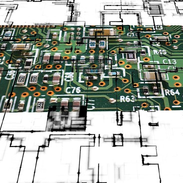

# HackCable

  

Éditeur de câblage électronique (Arduino, ESP32, et catalogue Fritzing) : placez des composants, tirez des fils, exportez le schéma.

**Dépôt de ce fork :** [github.com/A-S-T-U-C-E/HackCable](https://github.com/A-S-T-U-C-E/HackCable)  
**Démo en ligne :** [a-s-t-u-c-e.github.io/HackCable](https://a-s-t-u-c-e.github.io/HackCable/)

## Origine (projet amont)

Ce dépôt est un **fork** de **[HackCable](https://github.com/ClementGre/HackCable)** par **Clément Grennerat** ([@ClementGre](https://github.com/ClementGre)).  
Les idées, l’architecture d’origine et la licence du projet amont restent la référence ; ce fork y ajoute des évolutions et maintenance dans l’organisation [A-S-T-U-C-E](https://github.com/A-S-T-U-C-E).

- Amont / upstream : <https://github.com/ClementGre/HackCable>  
- Démo du projet d’origine : <https://clementgre.github.io/HackCable/>

## Objectifs

- Fournir une interface graphique pour câbler des composants sur une carte.
  - [Wokwi Elements](https://github.com/wokwi/wokwi-elements) pour la définition / l’affichage des composants
  - [Draw2D](http://www.draw2d.org) pour le système de câblage
- Intégrer un catalogue de pièces [Fritzing](https://github.com/fritzing/fritzing-parts) (vue breadboard)
- Exporter le plan (image, SVG) et sauvegarder / recharger un schéma (`.hackcable`)

### Structure du projet

HackCable est écrit en TypeScript, avec Webpack et Babel.

Une seule configuration npm, deux configurations Webpack et deux dossiers principaux :

- `src` : code de la bibliothèque
- `web` : site de test et d’exemple d’utilisation (tâches `:web` avec `webpack.config.web.js`)

## Tâches npm

Vérification / génération TypeScript :

- `type-check`
- `type-check:watch`
- `build:types`

Build de la bibliothèque :

- `build:src`

Build ou serveur de dev pour la page web :

- `build:web`
- `serve:web`

Documentation API (JSDoc → Markdown/HTML) :

- `docs` — génère `docs/api/`
- `docs:watch` — régénère à chaque changement sous `src/`

Démos vidéo (Playwright, serveur `:9000` requis) :

- `demo:record` — scénario découverte
- `demo:record:ctx` — menu contextuel

## Démo vidéo

- [1. Découverte](docs/demo/1.decouverte.mp4) — catalogue, placement, câblage  
- [2. Survol des fonctions](docs/demo/2.survol_de_fonctions.mp4) — menu contextuel et actions du plan  

Détails et régénération : [docs/demo/README.md](docs/demo/README.md).

## Documentation

- [Raccourcis clavier](docs/keyboard-shortcuts.md) — guide utilisateur (Alt+O, Alt+S, menu contextuel…)
- [Guide de maintenance](docs/MAINTENANCE.md) — pour contribuer / s’y retrouver
- [Architecture](docs/architecture.md) — aperçu des modules
- [Algorithmes de tracé des fils](docs/wire-routers.md) — différences entre les routeurs draw2d
- [API table des broches MCU](docs/mcu-pin-api.md) — broches connectées ou non (µcBlockly…)
- [Référence API générée](docs/api-reference.md) — comment produire et consulter `docs/api/` (`npm run docs`)

## Licence

[GPL-3.0-or-later](LICENSE) — Copyright (c) 2021, Clément Grennerat ; contributions du fork A-S-T-U-C-E.
